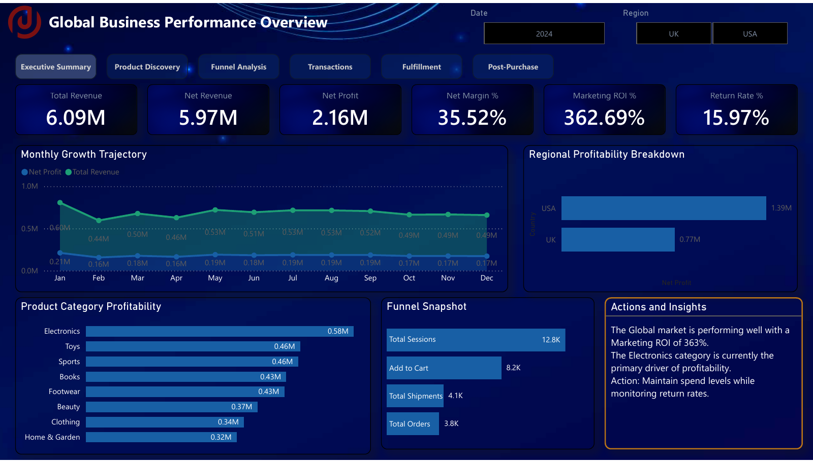
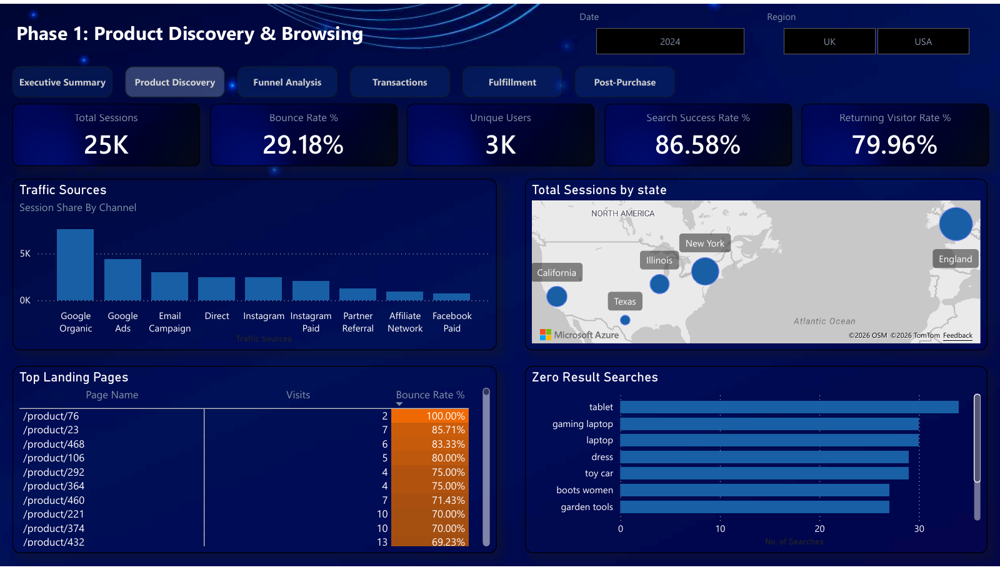
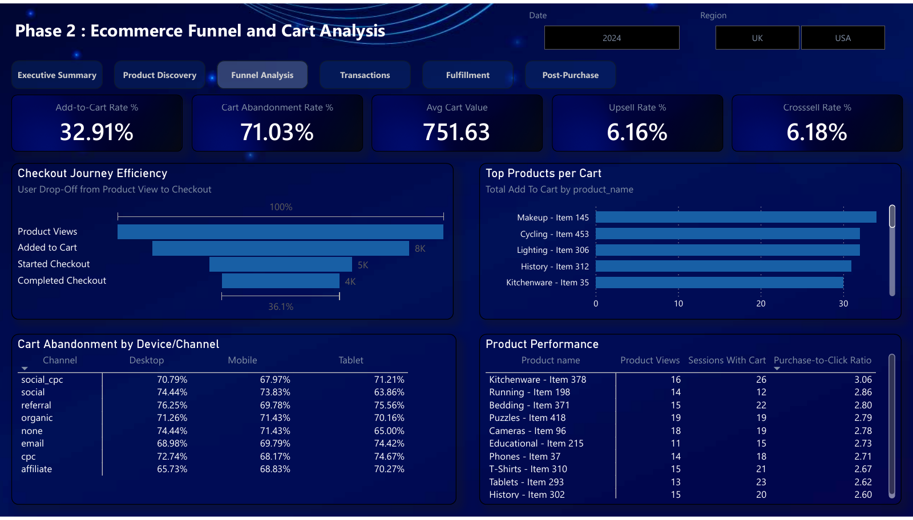
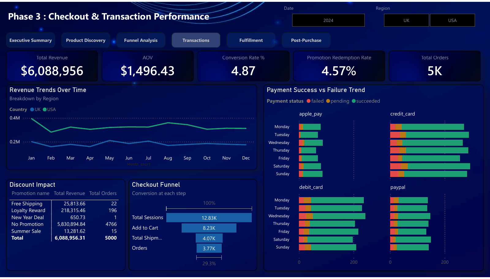
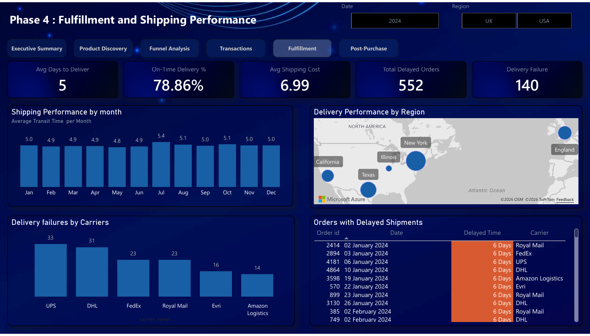
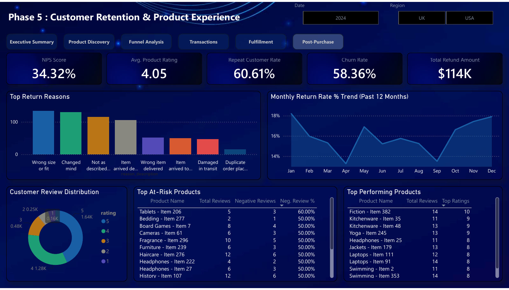
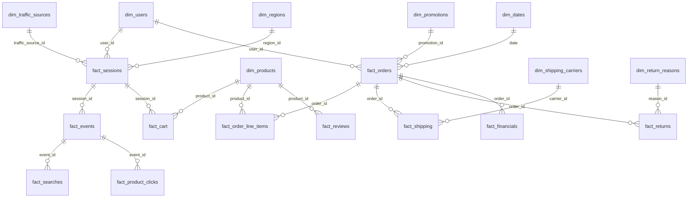

# 🛒 E-Commerce Conversion & Funnel Analytics — Power BI


**A 6-page Power BI dashboard that follows the customer journey from first search to refund, and shows a new UK/US online store exactly where its revenue is leaking.**

<p align="center">
  
</p>

---

## 📌 At a glance

| | |
|---|---|
| **Domain** | E-commerce (UK & US markets), full 2024 year |
| **Tool stack** | Power BI Desktop · DAX · Dimensional (star-schema) modeling |
| **Scope** | 25K sessions · 5,000 orders · 6 carriers · 8 product categories |
| **Data** | **Synthetic, AI-generated dataset** simulating UK/US e-commerce activity (no real customers or personal data) |
| **Model** | 21 tables (8 dimensions, 13 facts) · 53 relationships · 92 DAX measures |
| **Built from** | A 50-page BI requirements document (KRAs, KPIs, KRIs, wireframes, data model) |
| **My role** | Sole developer: data modeling, DAX measures, dashboard design, and insight writing |
| **Deliverable** | 6 interactive pages with Date and Region (UK/USA) slicers and page navigation |

**Headline numbers**

| Revenue | Net Profit | Net Margin | Return Rate | On-Time Delivery | Cart Abandonment |
|:---:|:---:|:---:|:---:|:---:|:---:|
| **$6.09M** | **$2.16M** | **35.5%** | **16.0%** | **78.9%** | **71.0%** |

> **Data note:** this project uses a **synthetic, AI-generated dataset** built to match the requirements schema. All figures illustrate the analytical approach, not the performance of a real business. See [About the data](#-about-the-data).

---

## 🎯 The business problem

A newly launched online retailer selling in the UK and US has its data scattered across five systems: **web analytics, orders, payments, shipping carriers, and returns.** Nobody can answer the questions that decide whether a launch succeeds:

- **Where do shoppers drop off** between landing on the site and paying, and what does it cost?
- **Which products, categories and regions actually earn profit**, not just revenue?
- **Are promotions earning their discount**, or just giving margin away?
- **Are orders arriving on time**, and which carriers are failing?
- **Why do customers return products**, and which items are hurting satisfaction?

Without one trusted view, marketing, operations and leadership each work from different numbers and fix the wrong things.

**This project is that single source of truth:** a decision-support dashboard where each page maps to one stage of the customer journey and one owner (marketing, merchandising, finance, operations, customer experience). Every metric is tied to a Key Result Area from the requirements document and, where the requirements defined one, checked against its Key Risk Indicator threshold.

---

## 🧭 What I built

| # | Page | Business question it answers | Headline KPIs |
|---|------|------------------------------|---------------|
| 1 | **Executive Summary** | Is the business healthy, and what should leadership do this week? | Revenue, Net Revenue, Net Profit, Net Margin, Marketing ROI, Return Rate + an *Actions & Insights* panel |
| 2 | **Product Discovery** | How do people find us, and is search working? | Sessions, Bounce Rate, Unique Users, Search Success Rate, Returning Visitor Rate |
| 3 | **Funnel & Cart Analysis** | Where do we lose shoppers between product view and checkout? | Add-to-Cart Rate, Cart Abandonment, Avg Cart Value, Upsell and Cross-sell Rate |
| 4 | **Checkout & Transactions** | Is checkout converting, and do promotions pay off? | Revenue, AOV, Conversion Rate, Promotion Redemption, Orders |
| 5 | **Fulfillment & Shipping** | Do orders arrive on time, and which carriers fail? | Avg Days to Deliver, On-Time %, Shipping Cost, Delayed Orders, Delivery Failures |
| 6 | **Post-Purchase** | Are customers happy, returning, and coming back? | NPS, Avg Rating, Repeat Customer Rate, Churn, Refund Amount, Return trend |

<details>
<summary><b>📸 See all pages</b></summary>

| | |
|---|---|
|  |  |
|  |  |
|  | |

A full PDF export is in [`dashboard/`](dashboard/Ecommerce_Funnel_Analytics_Dashboard.pdf).

</details>

---

## 🔍 Key insights and recommendations

**1. Cart abandonment is the biggest leak, and it's systemic.**
Abandonment is **71.03%**, above the 60% risk threshold set in the requirements. It sits between **64% and 76% in every channel × device combination**, which points to a checkout-wide problem rather than one weak channel or device.
➜ *Recommend:* guest checkout, shipping and fees shown earlier, and automated cart-recovery emails.

**2. Revenue is slipping while margin stays healthy.**
Monthly revenue falls from **$0.60M in January to about $0.49M by Q4 (≈ -18%)** while net margin holds at 35.5%. This is a demand and conversion problem, not a cost problem.
➜ *Recommend:* put effort into acquisition quality and checkout conversion before cutting costs.

**3. Discounts show no sign of lifting basket size.**
**95% of orders (4,766 of 5,000)** used no promotion. Promotion orders also generate *less* revenue per order than non-promotion orders (e.g. Loyalty Reward ≈ $1,114 vs ≈ $1,223).
➜ *Recommend:* target promotions at specific segments and A/B test them, rather than broad discounting.

**4. Search appears to be losing demand it could serve.**
Top zero-result queries include *laptop, gaming laptop, tablet, dress, boots women, toy car, garden tools*, all for categories the catalog appears to carry. That suggests a search-matching issue (plurals, synonyms), not a product gap.
➜ *Recommend:* add synonym and typo handling, and "did you mean" fallbacks.

**5. About 1 in 5 deliveries is late, and two carriers drive failures.**
On-time delivery is **78.86%**, with **552 delayed orders** and **140 delivery failures**. UPS and DHL account for **64 of the 140 failures (46%)**. (Raw counts; carrier volume share isn't normalised on the page.)
➜ *Recommend:* review carrier SLAs, normalise failures by shipment volume, and set realistic delivery estimates.

**6. Profit is concentrated.**
**Electronics is the top profit category ($0.58M)** and the **US delivers about 64% of net profit** ($1.39M vs $0.77M for the UK).
➜ *Recommend:* protect Electronics availability and investigate what is holding UK profitability back.

**7. Customer sentiment is good, but returns are costly.**
Average rating is **4.05★**, with about 77% of reviews at 4–5 stars. Even so, the return rate is **15.97%** and refunds total **$114K**. Return reasons range from size and fit to defects and wrong-item shipments.
➜ *Recommend:* separate controllable reasons (listing accuracy, quality control, fulfillment errors) from preference-driven ones, and fix the controllable ones first.

### 🚦 KRI health check (requirements vs. actuals)

| Key Risk Indicator | Threshold in requirements | Actual | Status |
|---|:---:|:---:|:---:|
| Session bounce rate | > 70% | 29.18% | 🟢 Healthy |
| Cart abandonment rate | > 60% | 71.03% | 🔴 Breached |
| Return rate | none defined | 15.97% | 🟡 Recommend setting a threshold |

---

## 📦 About the data

The dataset is **synthetic and AI-generated**. It was created to follow the schema in the requirements document, so the model, relationships and metrics behave like a real e-commerce platform without using any real customer information.

- **No real people or businesses:** names, emails, orders and reviews are simulated.
- **Purpose:** to demonstrate requirements-to-dashboard delivery, dimensional modeling, DAX and insight writing on realistic, relational data.
- **How to read the findings:** insights are written as I would present them on live data, but some patterns (for example, cart abandonment that is nearly uniform across channels and devices) may be a product of how the data was generated. Applied to a real store, the same model and measures would be pointed at the live source systems.

---

## 🧱 Data model & schema

The model is a **star schema with conformed dimensions**: every fact table stores measurable events at a defined grain, and shared dimensions (date, user, product, region…) let any metric be sliced the same way across the whole report. It was designed for scalable analytics and a single source of truth.

Simplified relationship view of the core tables:



**Dimensions (8):** `dim_dates` · `dim_users` · `dim_products` · `dim_regions` · `dim_traffic_sources` · `dim_promotions` · `dim_return_reasons` · `dim_shipping_carriers`

**Facts (grouped by journey stage):**

| Journey stage | Fact tables | Grain |
|---|---|---|
| Discovery | `fact_sessions`, `fact_events`, `fact_searches`, `fact_product_clicks` | One row per session / event / search / click |
| Cart & funnel | `fact_cart`, `fact_product_relationships` | One row per cart action; one row per upsell/cross-sell rule |
| Checkout | `fact_orders`, `fact_order_line_items` | One row per order / per product in an order |
| Fulfillment | `fact_shipping` | One row per shipment |
| Post-purchase | `fact_returns`, `fact_reviews`, `fact_survey_nps` | One row per returned product / review / survey response |
| Finance | `fact_financials` | One row per product sold (revenue, COGS, net profit) |

**Which tables power which page**

| Dashboard page | Main tables |
|---|---|
| Executive Summary | `fact_financials`, `fact_orders`, `dim_products`, `dim_regions` |
| Product Discovery | `fact_sessions`, `fact_events`, `fact_searches`, `dim_traffic_sources`, `dim_regions` |
| Funnel & Cart | `fact_cart`, `fact_order_line_items`, `fact_product_relationships`, `dim_products` |
| Checkout & Transactions | `fact_orders`, `dim_promotions`, `dim_dates` |
| Fulfillment & Shipping | `fact_shipping`, `dim_shipping_carriers`, `dim_regions` |
| Post-Purchase | `fact_returns`, `dim_return_reasons`, `fact_reviews`, `fact_survey_nps` |

**Extended beyond the requirements.** The requirements gave the base design; in the model I added fields to support profitability and customer analysis:
- `fact_financials`: `gross_profit`, `marketing_cost_alloc`, `ops_cost_alloc` (alongside COGS and net profit), enabling net margin and Marketing ROI
- `dim_users`: `customer_segment`, `lifetime_orders`, `lifetime_value`, supporting repeat-customer and value analysis

**Design choices worth noting**
- **Conformed dimensions** keep definitions identical across pages, so "region" or "product" means the same thing everywhere.
- **Event-driven capture:** front-end actions (add to cart, apply promo, order shipped, return initiated) are mapped to logged events and target fact tables.
- **Fact tables separated by grain** (session, event, cart action, order, line item) to avoid double counting.

Full bus matrix and notes: [`docs/data-model.md`](docs/data-model.md)

---

## 🧠 Skills demonstrated

| Skill | Where you can see it |
|---|---|
| **Requirements → solution** | Translated a 50-page BI requirements document into 6 working pages, each tied to a KRA |
| **Dimensional modeling** | Star schema with 13 fact and 8 dimension tables, conformed dimensions, bus matrix |
| **DAX** | Funnel, conversion, abandonment, return, delivery and profitability measures ([KPI definitions](docs/kpi-definitions.md)) |
| **Dashboard design** | Consistent navy theme, KPI-first layout, drill-friendly visuals, slicers, in-report navigation |
| **Business storytelling** | Executive "Actions & Insights" panel; insights written as finding → impact → recommendation |
| **Risk thinking** | KRIs checked against thresholds, not just KPIs reported |
| **Data judgment** | Flagged small-sample noise and a data attribution gap (see below) |

---

## ⚙️ Challenges and decisions

- **Cross-session attribution gap.** Orders could not be reliably traced back to individual sessions, so a session-level funnel would have overstated or understated conversion. I redesigned the funnel metrics at **product level** (views → carts → purchases), which is why the Funnel page reports a *Purchase-to-Click Ratio* per product.
- **Small-sample noise.** Some landing pages and "at-risk" products rest on only a handful of visits or reviews (e.g. a 100% bounce rate on 2 visits). These are best read as watch-list items, not conclusions.
- **Marketing cost is an allocation, not campaign spend.** The requirements noted that detailed marketing spend wasn't available, so the model carries an allocated marketing cost per order (`marketing_cost_alloc`). Marketing ROI is therefore an indicative figure, and true CAC by channel is left as future work once campaign-level spend is integrated.

---

## 🗂️ Repository structure

```
ecommerce-funnel-analytics-powerbi/
├── README.md
├── dashboard/
│   └── Ecommerce_Funnel_Analytics_Dashboard.pdf   # 6-page export
├── images/                                        # page screenshots
├── docs/
   ├── requirements-summary.md                    # scope, goals, KRAs per journey stage
   ├── kpi-definitions.md                         # every KPI, definition, page
   └── data-model.md                              # ER diagram + bus matrix

```

## ▶️ How to explore

1. Browse the screenshots above, or open the [PDF export](dashboard/Ecommerce_Funnel_Analytics_Dashboard.pdf).
2. Read the [requirements summary](docs/requirements-summary.md) to see the business context each page was built for.
3. Check the [KPI definitions](docs/kpi-definitions.md) to see how each number is calculated.

<!-- Add once published: **🔗 Live interactive dashboard:** [Open in Power BI](YOUR_PUBLISH_TO_WEB_LINK) -->

---

## 🔗 Related projects

- 📊 **Business Insights 360** — multi-page enterprise Power BI dashboard
- 🧮 [Ecommerce Funnel Analysis (BigQuery SQL)](https://github.com/FemAbdul/Ecommerce-funnel-analysis-bigquery) — SQL-side funnel analysis
- 🦠 [COVID-19 SQL Analytics](https://github.com/FemAbdul/covid19-sql-analytics)

## 👩‍💻 About me

**Femila Abdul Kareem** — Data Analyst & Power BI Developer based in Abu Dhabi, UAE, with a software development background. I'm open to **Data Analyst and BI Developer roles in the UAE**.

GitHub: [@FemAbdul](https://github.com/FemAbdul)

---

*Dataset is synthetic and AI-generated; no real customer data is used. *
