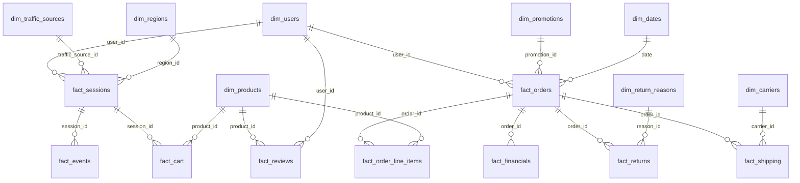

# Data Model

The model follows a **star schema** design with **conformed dimensions** shared across fact tables, so metrics from different journey stages can be sliced by the same date, region, product and user.

## Additions to the designed schema
- `fact_financials`: gross_profit, marketing_cost_alloc, ops_cost_alloc
- `dim_users`: customer_segment, lifetime_orders, lifetime_value

## Entity relationship overview (core tables)

## Table inventory
**Dimensions:** dim_dates, dim_users, dim_products, dim_regions, dim_traffic_sources, dim_promotions, dim_return_reasons, dim_shipping_carriers

**Facts:** fact_sessions, fact_events, fact_searches, fact_product_clicks, fact_cart, fact_orders, fact_order_line_items, fact_product_relationships, fact_shipping, fact_returns, fact_reviews, fact_survey_nps, fact_financials

## Bus matrix

| Fact table | date | users | traffic_sources | products | promotions | regions | return_reasons |
|---|:-:|:-:|:-:|:-:|:-:|:-:|:-:|
| fact_sessions | ✅ | ✅ | ✅ | ✅ | – | ✅ | – |
| fact_events | ✅ | ✅ | ✅ | ✅ | – | ✅ | – |
| fact_searches | ✅ | ✅ | – | ✅ | – | – | – |
| fact_cart | ✅ | ✅ | ✅ | ✅ | – | ✅ | – |
| fact_orders | ✅ | ✅ | – | ✅ | ✅ | ✅ | – |
| fact_order_line_items | ✅ | ✅ | ✅ | ✅ | ✅ | ✅ | – |
| fact_product_relationships | ✅ | – | – | ✅ | – | – | – |
| fact_shipping | ✅ | ✅ | – | ✅ | – | ✅ | – |
| fact_returns | ✅ | ✅ | – | ✅ | – | ✅ | ✅ |
| fact_reviews | ✅ | ✅ | – | ✅ | – | ✅ | – |
| fact_financials | ✅ | ✅ | – | ✅ | – | – | – |

## Grain of the main facts
| Fact | Grain |
|---|---|
| fact_sessions | One row per website session |
| fact_events | One row per user event within a session |
| fact_cart | One row per cart action (add, remove, view, checkout initiated) |
| fact_orders | One row per order |
| fact_order_line_items | One row per product in an order |
| fact_shipping | One row per shipment |
| fact_returns | One row per returned product |
| fact_reviews | One row per review |
| fact_financials | One row per product sold (revenue, COGS, net profit) |

## Modeling note: attribution gap
Orders could not be reliably attributed back to individual sessions, so session-level funnel conversion was not dependable. Funnel analysis was therefore designed around **product-level** behaviour (views, add-to-cart, purchase) rather than session-to-order attribution.
